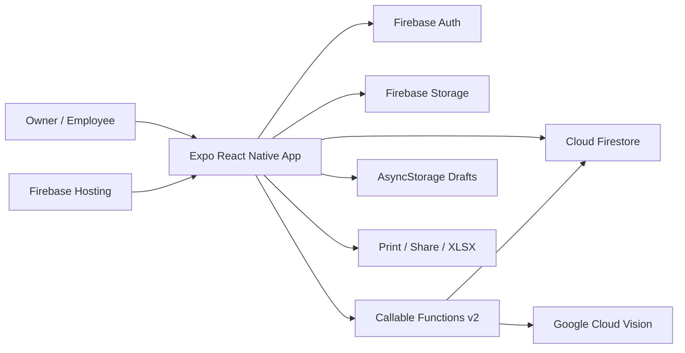

<div align="center">
  
  <h1>TODO(owner): Your Name</h1>
  <p><strong>TODO(owner): Professional Title · TODO(owner): Location</strong></p>
  <p>I build reliable, auditable operations software across mobile, web, and cloud.</p>
  <p>
    <a href="https://skillrout.web.app">Live Product</a> ·
    TODO(owner): Résumé · TODO(owner): Email · TODO(owner): LinkedIn
  </p>
  <p>Expo 53 · React Native · TypeScript · Firebase · Node.js · Docker · Spec-Driven Development</p>
</div>

> The repository contains a product icon but no verified personal portrait, résumé, location, email,
> or LinkedIn profile. Replace the clearly marked owner fields rather than publishing invented details.

## About me

| | Verified/project context |
|---|---|
| Core stack | TypeScript, React, React Native, Node.js |
| Front end | Expo Router, responsive native/web UI |
| Cloud / DevOps | Firebase, Cloud Functions, Firestore, Storage, Hosting, EAS, Docker |
| Based in | TODO(owner): location |
| Open to | TODO(owner): roles/opportunities |

## Skillrout

Skillrout is a multi-tenant bookkeeping and field-operations platform for businesses that operate
machines across stores. It separates visit evidence from financial settlement, coordinates employee
collection shifts, and gives owners an auditable reconciliation and reporting workflow.

| Public site | Accounts and security |
|---|---|
| Static Expo web landing and role-specific entry points | Firebase email/password, verified owners, tenant/store authorization, forced employee password change |
| **Owner operations** | **Engineering quality** |
| Stores, machines, employees, collections, reconciliation, adjustments, reports, Excel | Transactional settlement, immutable snapshots, retry-safe RUN, rules tests, offline conflict handling |



## Technology layers

| Layer | Implementation |
|---|---|
| UI and routing | Expo 53.0.20, React Native 0.79.5, React 19, Expo Router 5.1 |
| Client state | React hooks/contexts, Firestore, AsyncStorage drafts |
| Backend | Firebase callable Functions v2, Node.js 22, TypeScript |
| Data | Firestore owner-tenanted documents and Storage visit images |
| Integrations | Firebase Auth, Google Cloud Vision, Expo Print/Sharing, XLSX |
| Delivery | Expo static export, Firebase Hosting, EAS profiles, optional Docker/nginx |
| SDD | GitHub Spec Kit, Graphify, speckit-graphifyy bridge |

<details>
<summary>Project tree</summary>

```text
app/                 Expo Router screens: public, owner, employee
components/          Shared UI primitives
constants/           Design tokens
contexts/            Authentication and offline-draft state
helpers/             Calculations, validators, OCR, templates, exports
services/            Firebase client/service boundary
functions/src/       Callable backend, calculations, Cloud Vision OCR
tests/               Firestore and Storage rules tests
types/               Shared TypeScript contracts
docs/                Permanent repository-verified documentation
.specify/            Spec Kit templates, scripts, memory, extensions
.claude/skills/       Spec Kit and Graphify workflow skills
graphify-out/         Knowledge graph, report, and interactive map
specs/                Feature specifications and plans
```
</details>

## Run locally

### Prerequisites

| Tool | Version/evidence |
|---|---|
| Node.js | Functions require 22; use Node 22 for consistent local builds |
| npm | Lockfiles are committed |
| Firebase CLI | Required for emulators/deployment |
| JDK | Required by Firebase rules emulators |
| Expo-compatible simulator/browser | Optional for target-specific testing |

```bash
git clone https://github.com/Mehar1001/skillrout-app.git
cd skillrout-app
npm install
(cd functions && npm install)
cp .env.example .env
```

### Environment variables

All tracked variables are Firebase **web client configuration**, not Admin SDK secrets.

| Required | Example | Purpose |
|---|---|---|
| `EXPO_PUBLIC_FIREBASE_API_KEY` | `your-web-api-key` | Firebase client configuration |
| `EXPO_PUBLIC_FIREBASE_AUTH_DOMAIN` | `project.firebaseapp.com` | Auth domain |
| `EXPO_PUBLIC_FIREBASE_PROJECT_ID` | `project-id` | Firebase project |
| `EXPO_PUBLIC_FIREBASE_STORAGE_BUCKET` | `project.firebasestorage.app` | Visit images |
| `EXPO_PUBLIC_FIREBASE_MESSAGING_SENDER_ID` | `000000000000` | Firebase app configuration |
| `EXPO_PUBLIC_FIREBASE_APP_ID` | `1:...:web:...` | Firebase web app identity |

| Optional | Example | Purpose |
|---|---|---|
| `EXPO_PUBLIC_FIREBASE_MEASUREMENT_ID` | `G-XXXXXXXXXX` | Config field; Analytics is not initialized in source |

There are no tracked admin-bootstrap environment variables. Cloud Functions use Firebase application
default credentials; never place service-account JSON in the repository.

```bash
npm run web
```

### Try the owner flow

1. Open `/owner/register`, request access, and verify the email.
2. An already authorized owner must approve the pending request. The current authorization model permits
   any active owner to call approval; see the documented security gap before production onboarding.
3. Sign in at `/owner/login`.
4. Create a store and machines, then create/assign an employee.
5. Sign in through `/employee/login`, start a shift, run and submit a positive visit, and finish the route.
6. Return as owner to Collections, reconcile each store, close the shift, and verify Shift Reports/Excel.

## npm scripts

| Command | Purpose |
|---|---|
| `npm start` | Expo development server |
| `npm run android` / `ios` / `web` | Start a platform target |
| `npm run typecheck` | TypeScript check |
| `npm run lint` | Expo ESLint |
| `npm test` | Client helper tests |
| `npm run test:calculations` | Calculation tests |
| `npm run test:validators` | Validator tests |
| `npm run test:rules` | Firestore/Storage emulator tests |
| `npm run verify` | Typecheck + lint + client tests |
| `cd functions && npm run build` | Compile Functions |
| `cd functions && npm test` | Build and test Functions |
| `cd functions && npm run serve` | Functions emulator |
| `cd functions && npm run deploy` | Deploy Functions (production side effect) |

<details>
<summary>Callable API reference</summary>

The app uses Firebase callable APIs rather than REST: account/employee lifecycle, receipt OCR,
`runVisit`, split/submission/adjustment, employee store/machine onboarding, and Collection Shift
start/get/finish/reconcile/close. See [`docs/06-api-contracts.md`](docs/06-api-contracts.md) for all 24
handlers, actors, request/result summaries, and failure contracts.
</details>

## Testing and deployment

Run `npm run verify`, Function lint/build/tests, `npm run test:rules`, and a web export before release.
Firebase Hosting serves `dist/`; Functions, Firestore, and Storage deploy through Firebase CLI. There is
no repository CI workflow. See [testing](docs/11-testing-strategy.md) and
[infrastructure](docs/09-infrastructure-and-deployment.md).

## Spec-driven workflow

Permanent context lives in `docs/`; governance lives in `.specify/memory/constitution.md`; feature work
lives in `specs/`. Graphify maps current code dependencies and must be refreshed after code changes.
See [`speckit-readme.md`](speckit-readme.md).

## Documentation

Start with [`docs/00-project-overview.md`](docs/00-project-overview.md). Business training and acceptance
remain in `USER_GUIDE.md`, `UAT.md`, and `COLLECTION_SHIFT_UAT_SIGNOFF.md`.

## Let’s talk

TODO(owner): Add a verified email, LinkedIn profile, résumé, and preferred opportunities.
