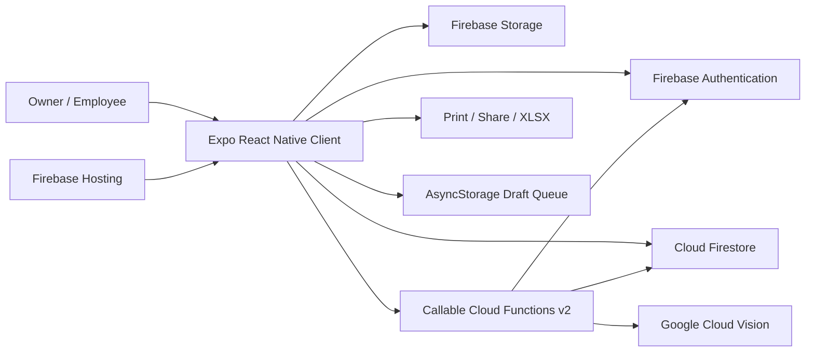

# Architecture

## System boundaries

## Client

Expo Router maps files in `app/` to public, owner, and employee routes. Owner screens use a tab layout; employee screens use a stack and responsive navigation shell. `AuthContext` resolves role/tenant state. `DraftQueueContext` manages local queued visits. Services encapsulate Firebase calls; helpers hold calculations, validation, OCR parsing, templates, and report transformations.

## Backend

All privileged server behavior is implemented as Firebase v2 callable Functions in `functions/src/index.ts`, globally configured for `us-central1`. Functions validate authentication, resolve owner/employee tenancy, and perform sensitive Firestore writes. `submitVisit`, shift transitions, reconciliation, close, and adjustment use server-side validation; settlement-sensitive updates use Firestore transactions.

## Data and communication

The browser/native client reads permitted Firestore documents directly and calls Functions for privileged mutations. Tenant operational data is owner-nested. Employees are top-level identities linked by `ownerId`. Storage objects are scoped to a visit. Cloud Vision is called only by Functions.

## Deployment

Static web output is exported to `dist/` and served by Firebase Hosting with SPA rewrites. Native build profiles are defined in `eas.json`. Docker/nginx is an optional static-hosting package, not the production architecture proven by the repository.

See [Data model](05-data-model.md), [APIs](06-api-contracts.md), and [Security](07-auth-and-security.md).
